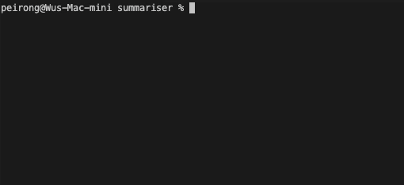

# summariser

A `node` CLI, `summariser` gives a summary of your finance portfolio based on the orders you listed in `.summariser.json`.



- [Installation](#installation)
- [Usage](#usage)
- [.summariser.json](#summariserjson)

## Installation

- Clone this repo
- `cd summariser`
- `npm i -g`
- `summariser init`
- `summariser start`

## Usage

### `summariser init`

- Initializes a `.summariser.json` in your home directory (`~/` for Mac users) which contains a sample template you can modify in your favourite editor.

### `summariser start`

- The main command you will be using most frequently. It reads `.summariser.json`, processes the orders and prints to console a summary of your portfolio performance.

### `summariser find ${ticker}`

- Accepts a required argument, `ticker`, and outputs a list of similarly spelled financial product tickers.
- It aims to autocorrect and provides suggestions for any `ticker` you do not know the spelling of.

## `.summariser.json`

Contains information about the orders you have made. Repeated orders for the same ticker are accepted and they will be grouped together in the final output.

```json
{
  "orders": [
    { "ticker": "AAPL", "volume": 1000, "cost": 124, "purchaseDate": "2019-5-3" },
    { "ticker": "AAPL", "volume": 2000, "cost": 120, "purchaseDate": "2019-7-25" }
  ]
}
```

| Name     | Type          | Description                  |
| -------- | ------------- | ---------------------------- |
| `orders` | OrderConfig[] | The orders in your portfolio |

### OrderConfig

| Name           | Type   | Description                                                                     |
| -------------- | ------ | ------------------------------------------------------------------------------- |
| `ticker`       | string | Stock or option symbol as listed in [Yahoo finance](https://finance.yahoo.com/) |
| `volume`       | number | Number of shares bought this order                                              |
| `cost`         | number | Per-share cost                                                                  |
| `purchaseDate` | string | Date of order purchase in `YYYY-MM-DD` format                                   |
